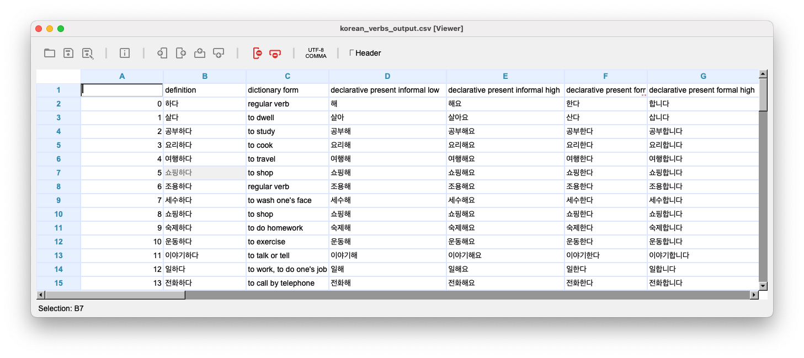

# Korean Verbs to CSV

This Python script will take a list of Korean verbs and adjectives from a text file (korean_verbs_input.txt) and scrape the website KoreanVerbs.app for a full list of the verb/adjective's forms. The data is output to a CSV file (korean_verbs_output.csv).

## How to Use

1. Save the repository to your computer. Open the input file (korean_verbs_input.txt) and enter in the verbs or adjectives that you want to return verb forms for.
2. Run the Python script (korean_verbs_to_csv.py). Make sure the input file is in the same folder as the Python script.
3. The script generates a CSV file (korean_verbs_output.csv) to the same folder.

## Usage

Feel to use this script for personal use or adapt as you see fit, with credit to the original author.

## Example of Output File

## Korean Verb Conjugator (https://koreanverbs.app)

